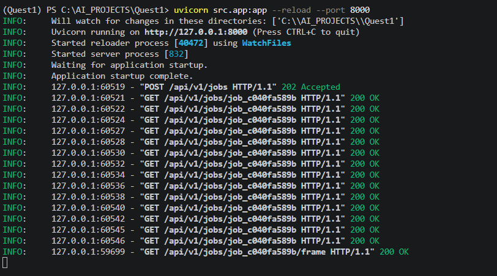
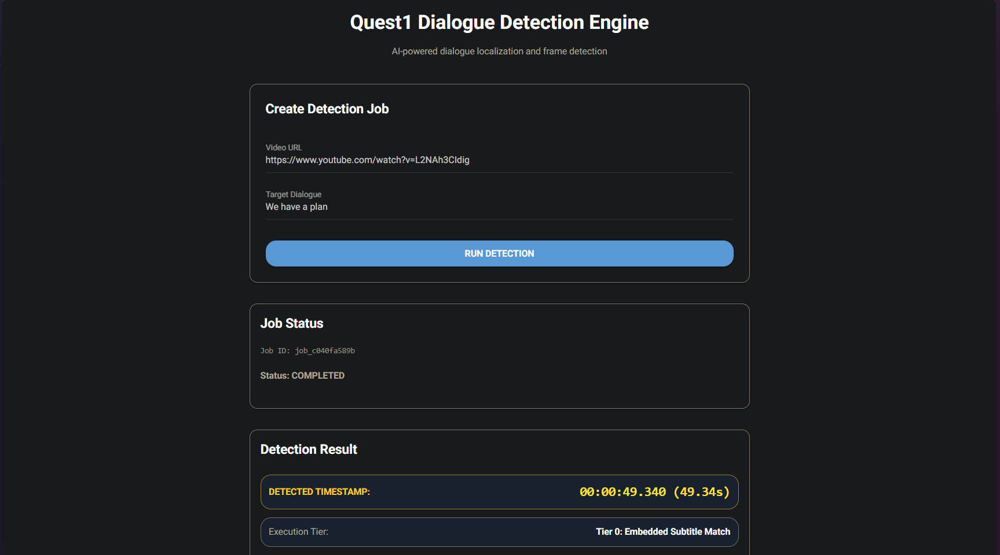

# My project for Quest1 — Dynamic Dialogue Detection Engine

My project is an end-to-end AI-powered media analysis system designed to locate target spoken or visual dialogue occurrences inside video content.

Given a video source and a target dialogue, My project analyzes the media using a progressive five-tier detection pipeline to determine:

- Where the dialogue occurs
- Whether it appears through speech or visual text
- Candidate frame locations
- Confidence scores
- Detection evidence from multiple modalities

The system supports:

- Local video files
- Remote video URLs
- CDN-hosted streams
- Adaptive streaming sources
- Standard MP4 media

Instead of relying on a single detection method, My project combines subtitle analysis, speech recognition, OCR-based visual search, and Vision-Language Model verification to provide reliable dialogue localization.

---

# Overview

Traditional video search systems often depend on a single modality:

- Speech recognition only
- Subtitle matching only
- OCR only

However, real-world media introduces several challenges:

- Videos may not contain subtitles
- Dialogue may be spoken but never appear visually
- Streaming sources may block automated access
- Large media files may exceed API payload limits

My project addresses these challenges using a progressive fallback architecture.

```text
                         Video Source

                              |
                              v

                    Media Ingestion Layer

                              |
                              v

                   Detection Pipeline

                              |
        ------------------------------------------------
        |              |              |                |
        v              v              v                v

   Subtitles        Speech          OCR             VLM
   Matching          STT          Search        Validation

                              |
                              v

             Detection Result / Uncertain Result
```

---

# Core Features

## Five-Tier Detection Pipeline

My project dynamically increases computational complexity only when required.

```text
Fast + Low Compute

        |
        v

Tier 0
Embedded Subtitle Matching

        |
        v

Tier 1
Speech-to-Text Alignment

        |
        v

Tier 2
Sparse OCR Timeline Search

        |
        v

Tier 3
Dense OCR Frame Confirmation

        |
        v

Tier 4
Vision-Language Model Arbitration

        |
        v

Validated Detection Result
```

This architecture allows inexpensive methods to resolve simple cases while reserving heavier AI processing for difficult scenarios.

---

# Detection Pipeline Details

The main orchestration logic is implemented in:

```
src/pipeline.py
```

---

## Tier 0 — Embedded Subtitle Matching

The pipeline first checks available subtitle sources.

Supported sources:

- Embedded subtitle tracks
- VTT subtitle files

The system performs sequence similarity matching against the target dialogue.

Advantages:

- Fast execution
- Low computational cost
- Accurate localization when subtitles exist

---

## Tier 1 — Speech Recognition Alignment

When subtitle information is unavailable, My project uses speech recognition.

The system:

- Extracts audio from the video
- Processes speech content
- Generates timestamps
- Aligns the target dialogue

The speech pipeline supports:

- Chunk-based audio processing
- Timestamp reconstruction
- Backoff handling for large media

This allows processing of longer media files while respecting inference constraints.

---

## Tier 2 — Sparse OCR Search

If speech-based localization is unavailable:

My project performs visual timeline searching.

The system:

- Samples frames across the video timeline
- Extracts visible text
- Compares OCR output with the target dialogue

Useful for:

- Title cards
- Signs
- Posters
- Hardcoded subtitles
- Visual-only dialogue

---

## Tier 3 — Dense OCR Confirmation

After detecting a candidate region:

My project performs focused OCR analysis around the identified window.

This improves:

- Frame selection accuracy
- Timestamp precision
- Visual confirmation

The goal is to identify the strongest matching frame.

---

## Tier 4 — Vision-Language Model Arbitration

When OCR confidence is insufficient:

My project extracts multiple candidate frame windows.

The Vision-Language Model evaluates candidates using:

- Text visibility
- Spatial context
- Visual consistency

This provides additional validation when OCR alone cannot confidently determine the correct frame.

---

# Media Ingestion and Stream Processing

Implementation:

```
src/ingestion.py
```

The ingestion layer prepares media sources before detection.

---

## CDN and Adaptive Stream Handling

My project supports:

- Remote streaming URLs
- CDN-hosted media
- Tokenized stream URLs
- Standard video files

When direct stream extraction is unavailable, the system can route processing through cached media extraction.

---

## Header Injection

For protected remote streams, My project supports request headers such as:

- User-Agent
- Referer

This improves compatibility with restricted media sources.

---

## Audio Validation

Before speech processing:

My project validates:

- Available audio streams
- Compatible codec formats

Audio is converted into:

```
16kHz
Mono
PCM WAV
```

for speech recognition compatibility.

---

## Windows OpenCV Protection

Direct OpenCV remote stream access can fail on Windows environments.

My project avoids this by:

- Using FFmpeg seeking for remote frame extraction
- Using OpenCV primarily for local processing

This improves reliability during frame extraction.

---

# Handling Large Media and API Constraints

Large media files introduce several challenges:

- Upload limitations
- Network interruptions
- Processing failures

My project handles these through:

- Audio chunk extraction
- Sequential processing
- Timestamp offset reconstruction
- Controlled model requests

This allows large media processing without requiring the entire file to be processed as a single request.

---

# OK.ru and Remote Stream Handling

Some remote platforms, including OK.ru, may fail due to:

- ISP restrictions
- Campus network policies
- CDN protection
- Remote access limitations

In such cases, the failure occurs before the detection pipeline begins.

Recommended solutions:

1. Verify the URL accessibility.
2. Try another network connection.
3. Download the media locally.
4. Process the local file instead.

My project treats this as a source accessibility issue rather than a detection failure.

---

# Project Structure

```text
My project/

├── artifacts/
│   └── Generated job outputs, JSON metadata, persistent frames

├── src/
│
│   ├── models/
│   │   └── schemas.py
│   │       └── Pydantic domain models
│
│   ├── app.py
│   │   └── FastAPI REST endpoints and background task routing
│
│   ├── config.py
│   │   └── System and environment configuration
│
│   ├── fallback_vlm.py
│   │   └── VLM candidate arbitration service
│
│   ├── ingestion.py
│   │   └── Stream probing, audio extraction and FFmpeg wrappers
│
│   ├── pipeline.py
│   │   └── Five-tier PipelineOrchestrator implementation
│
│   ├── primary_ocr.py
│   │   └── Sparse timeline and dense-window OCR scanners
│
│   └── primary_stt.py
│       └── Speech-to-Text service with chunking and alignment
│
├── temp_data/
│   └── Temporary audio chunks and raw frames
│
├── test_audio/
│   └── Validation media
│
├── tests/
│
│   ├── test_app.py
│   │   └── API endpoints, async jobs and frame serving
│
│   ├── test_config_and_schemas.py
│   │   └── Configuration and Pydantic validation
│
│   ├── test_fallback_vlm.py
│   │   └── VLM arbitration testing
│
│   ├── test_ingestion.py
│   │   └── Stream probing and FFmpeg extraction
│
│   ├── test_pipeline.py
│   │   └── Tier 0-4 pipeline orchestration
│
│   ├── test_primary_ocr.py
│   │   └── OCR processing validation
│
│   └── test_primary_stt.py
│       └── Audio chunking and alignment
│
├── Dockerfile
├── docker-compose.yml
├── frontend.py
│   └── NiceGUI asynchronous dashboard
│
├── architecture.md
├── prompts.txt
├── meta.json
├── pytest.ini
├── requirements.txt
└── Readme.md
```

---

# Setup and Installation

## Prerequisites

Before running My project, install:

- Python 3.10+
- FFmpeg
- Git

## Installing FFmpeg

### Windows

```bash
winget install --id Gyan.FFmpeg
```

### Ubuntu / Debian

```bash
sudo apt update
sudo apt install ffmpeg
```

### macOS

```bash
brew install ffmpeg
```

Verify installation:

```bash
ffmpeg -version
```

---

# Installation

## 1. Clone Repository

```bash
git clone https://github.com/josondev/My project.git

cd My project
```

---

## 2. Create Virtual Environment

### Windows

```bash
python -m venv venv

venv\Scripts\activate
```

### Linux / macOS

```bash
python3 -m venv venv

source venv/bin/activate
```

---

## 3. Install Dependencies

```bash
pip install -r requirements.txt
```

---

## 4. Environment Configuration

Create your environment file:

```bash
cp .env.example .env
```

Configure required API keys and runtime settings inside `.env`.

Example:

```env
MODEL_PROVIDER_API_KEY=<your_key>
```

---

# Running My project

## Start Backend API

Launch the FastAPI server:

```bash
uvicorn src.app:app --reload --port 8000
```

The backend will be available at:

```
http://127.0.0.1:8000
```

---

## Start Frontend Dashboard

Open another terminal:

```bash
python frontend.py
```

The NiceGUI dashboard will be available at:

```
http://127.0.0.1:8080
```

The dashboard allows:

- Submitting dialogue detection jobs
- Monitoring job status
- Tracking pipeline progress
- Viewing extracted frames

---

# Docker Execution

My project includes Docker support.

Build and run:

```bash
docker compose up --build
```

Docker configuration files:

```
Dockerfile
docker-compose.yml
```

---

# API Usage

My project exposes FastAPI endpoints for programmatic access.

## Create Detection Job

Endpoint:

```
POST /api/v1/jobs
```

Example:

```bash
curl -X POST http://127.0.0.1:8000/api/v1/jobs \
-H "Content-Type: application/json" \
-d '{
    "video_url": "YOUR_VIDEO_URL",
    "target_text": "YOUR_DIALOGUE"
}'
```

Response:

```json
{
    "job_id": "example-id",
    "status": "processing",
    "target_dialogue": "YOUR_DIALOGUE"
}
```

---

## Check Job Status

Endpoint:

```
GET /api/v1/jobs/{job_id}
```

Returns:

- Current processing status
- Detection metadata
- Confidence information
- Frame availability

---

## Retrieve Detection Frame

Endpoint:

```
GET /api/v1/jobs/{job_id}/frame
```

Returns:

The detected frame image if available.

---

# Screenshots

## Backend API

The FastAPI backend handles job creation, background execution, status tracking, and frame retrieval.



---

## Frontend Dashboard

The NiceGUI interface provides a user-friendly dashboard for submitting detection tasks and monitoring results.



---

## Detection Output

My project produces the final visual evidence frame corresponding to the detected dialogue.


---

# Technology Stack

| Component          | Technology                 |
| ------------------ | --------------------------- |
| Backend API        | FastAPI                    |
| Speech Recognition | Groq Whisper / HuggingFace |
| Media Extraction   | yt-dlp / FFmpeg            |
| OCR Processing     | OpenCV / RapidFuzz         |
| Arbitration        | Llama 3.2 Vision           |
| Data Validation    | Pydantic                   |
| Frontend           | NiceGUI                    |
| Test Suite         | Pytest                     |
| Containerization   | Docker / Docker Compose    |

---

# Testing

My project includes automated tests covering:

- API functionality
- Configuration validation
- Media ingestion
- Pipeline orchestration
- OCR processing
- Speech recognition handling
- VLM arbitration

Run tests:

```bash
pytest
```

---

# Design Philosophy

## Production-Oriented Reliability

Real-world media processing introduces unpredictable failures:

- Large files
- Network interruptions
- Restricted CDNs
- Model limitations
- API constraints

My project is designed around graceful handling of these failures through:

- Progressive fallback processing
- Media caching
- Chunked processing
- Validation between stages

---

## Progressive Computation

The system avoids unnecessary expensive processing.

The pipeline follows:

```
Cheap Evidence
      |
      v
More Expensive Validation
      |
      v
High Confidence Result
```

Subtitles and speech recognition are preferred before expensive OCR and Vision-Language Model processing.

---

## Multi-Modal Verification

My project separates:

- Spoken dialogue detection
- Visual text confirmation

A spoken sentence does not automatically mean the sentence appears on screen.

The system maintains this distinction to avoid producing incorrect visual results.

---

# Current Limitations

## Visual Confirmation Requires Visible Text

A dialogue can be correctly recognized through speech but may never appear visually.

In such cases:

- Speech recognition may locate the timestamp
- OCR cannot confirm a frame
- The system reports the result as uncertain

This prevents incorrect frame reporting.

---

## Remote Source Availability

Some streaming platforms may block automated access.

Examples:

- ISP restrictions
- Authentication requirements
- CDN policies

Recommended workaround:

- Use an accessible source URL
- Download the file locally
- Process the local video file

---

## OCR Accuracy

OCR performance depends on:

- Text size
- Video quality
- Font style
- Background complexity

Small or stylized text may require additional preprocessing.

---

# Future Improvements

Potential improvements include:

- More advanced OCR preprocessing
- Improved stream source compatibility
- Distributed processing for large media
- More frontend visualization features
- Additional model providers

---

# License

This project is intended for research and development purposes.
